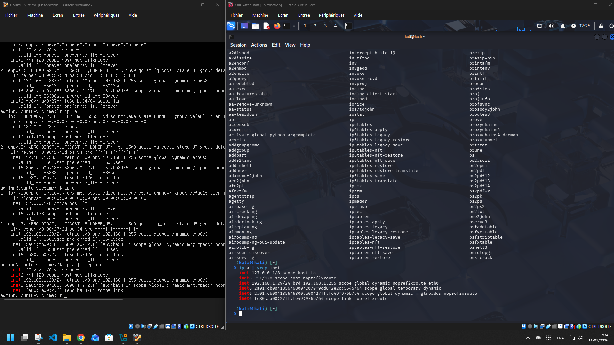
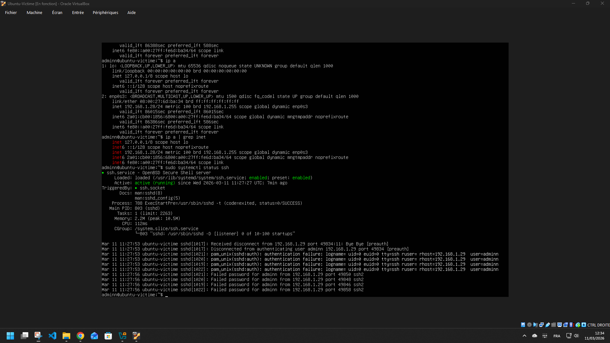
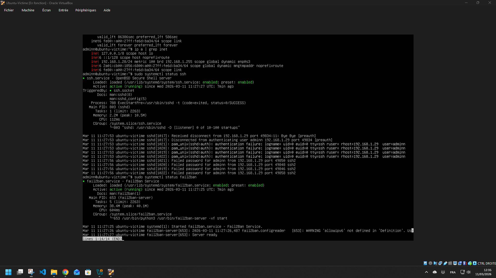
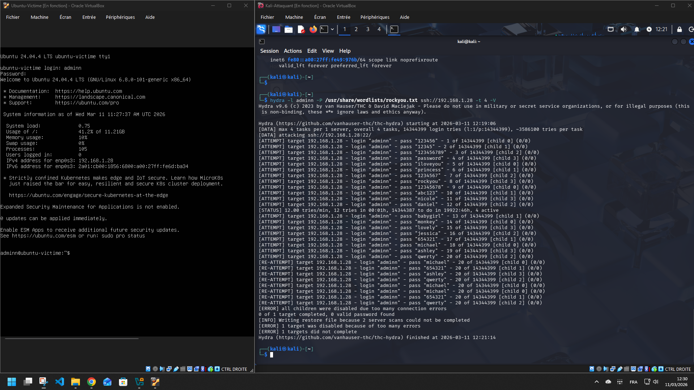
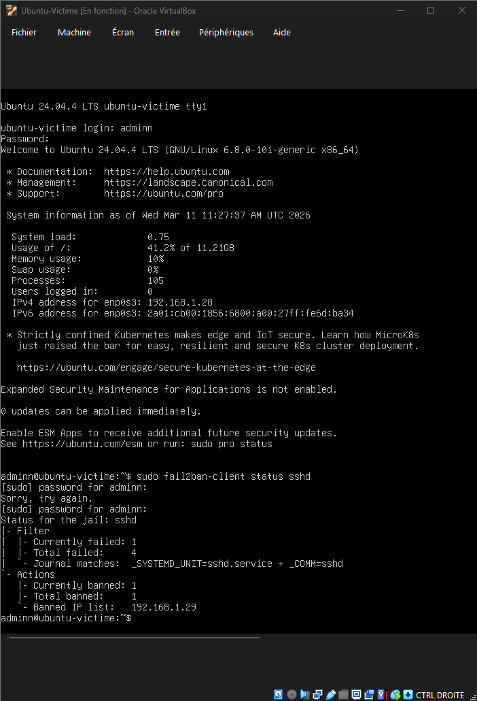
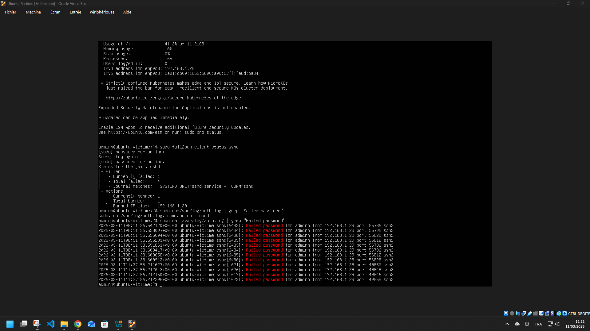

# 🛡️ Mini SOC Lab — Cybersecurity Home Lab

> Projet réalisé dans le cadre de ma montée en compétences en cybersécurité.  
> Simulation d'un environnement d'attaque/défense sous Linux avec des outils professionnels.

---

## 📌 Objectif

Mettre en place un laboratoire virtuel simulant une infrastructure réelle, avec :
- Un serveur Linux (cible)
- Une machine attaquante (Kali Linux)
- Des mécanismes de détection et de blocage automatique

---

## 🏗️ Architecture du Lab

```
┌─────────────────────────────────────────┐
│              Réseau virtuel             │
│                                         │
│  ┌─────────────────┐  ┌───────────────┐ │
│  │  Ubuntu Server  │  │  Kali Linux   │ │
│  │  (Victime)      │  │  (Attaquant)  │ │
│  │  192.168.1.28   │  │  192.168.1.29 │ │
│  │                 │  │               │ │
│  │  - SSH (port 22)│  │  - Hydra      │ │
│  │  - Apache       │  │  - Nmap       │ │
│  │  - Fail2Ban     │  │               │ │
│  └─────────────────┘  └───────────────┘ │
└─────────────────────────────────────────┘
```

---

## 🛠️ Stack technique

| Outil | Rôle |
|---|---|
| VirtualBox | Hyperviseur pour les VMs |
| Ubuntu Server 24.04 | Serveur cible |
| Kali Linux 2025 | Machine attaquante |
| OpenSSH | Service cible de l'attaque |
| Apache2 | Serveur web exposé |
| Fail2Ban | Détection et blocage automatique |
| Hydra | Outil de brute force SSH |

---

## 📋 Étapes réalisées

### Phase 1 — Mise en place de l'environnement

Configuration du réseau bridge avec les deux VMs sur le même sous-réseau (`192.168.1.0/24`).



---

### Phase 2 — Sécurisation du serveur

Installation et démarrage du service SSH sur Ubuntu, puis configuration de Fail2Ban :
- `maxretry = 3` → bannissement après 3 tentatives échouées
- `bantime = 3600` → bannissement d'1 heure
- `findtime = 600` → fenêtre de détection de 10 minutes





---

### Phase 3 — Simulation d'attaque brute force SSH

Depuis Kali Linux, lancement d'une attaque brute force SSH avec **Hydra** sur la wordlist `rockyou.txt` (14 millions de mots de passe réels).

```bash
hydra -l adminn -P /usr/share/wordlists/rockyou.txt ssh://192.168.1.28 -t 4 -V
```

**Fail2Ban a automatiquement bloqué l'attaque** après 3 tentatives échouées.



---

### Phase 4 — Analyse des logs

Vérification du bannissement de l'IP attaquante et lecture des traces dans les logs système.





---

## 🔍 Résultat

```
Status for the jail: sshd
|- Filter
|  |- Currently failed: 1
|  |- Total failed:     4
`- Actions
   |- Currently banned: 1
   `- Banned IP list:   192.168.1.29
```

**L'IP de Kali (192.168.1.29) a été automatiquement bannie après 3 tentatives échouées.**

---

## 📚 Compétences développées

- Administration Linux (`systemctl`, `journalctl`, `apt`, `nano`)
- Gestion des services et des logs système
- Configuration de pare-feu applicatif (Fail2Ban)
- Notions de réseau (IP, ports, SSH, ping)
- Utilisation d'outils offensifs en environnement isolé (Hydra)
- Analyse de logs d'intrusion (`auth.log`, `fail2ban.log`)

---

## 🚀 Améliorations prévues

- Ajout d'Auditd pour logger toutes les commandes système
- Scan de ports avec Nmap depuis Kali
- Mise en place d'un SIEM léger (ELK Stack)
- Rédaction de règles Snort/Suricata personnalisées

---

## ⚠️

Ce projet est réalisé dans un environnement **entièrement isolé** à des fins **éducatives uniquement**.  
Toute utilisation de ces techniques sur des systèmes sans autorisation explicite est illégale.
